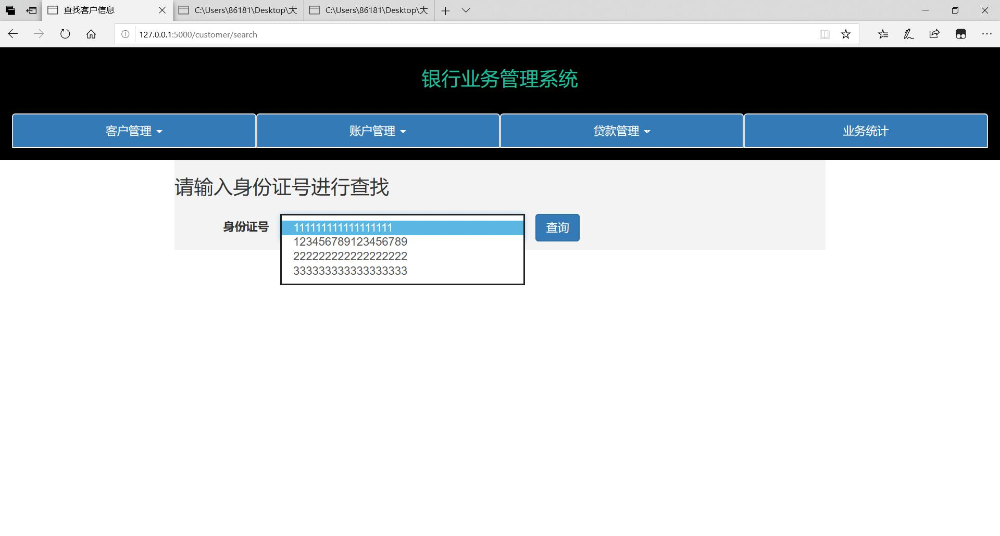
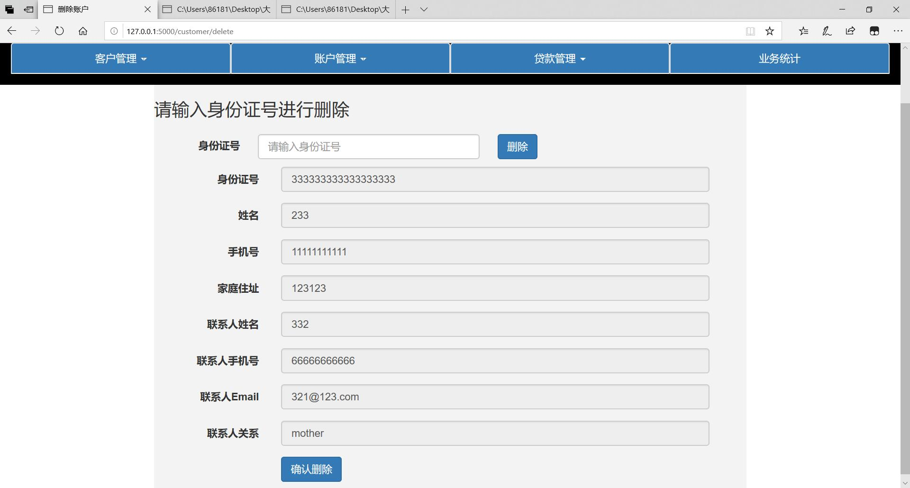

# 实验报告

[TOC]

***银行业务管理系统***

姓名：罗极羽

## 1.概述

### 1.1 系统目标

开发一个银行业务管理系统，具体的数据要求见[这里](./figs/db-lab03.pdf)

### 1.2 需求说明

* 客户管理：提供客户所有信息的增、删、改、查功能；如果客户存在着关联账户或者贷款记录，则不允许删除
* 账户管理：提供账户开户、销户、修改、查询功能，包括储蓄账户和支票账户；账户号不允许修改
* 贷款管理：提供贷款信息的增、删、查功能，提供贷款发放功能；贷款信息一旦添加成功后不允许修改；要求能查询每笔贷款的当前状态（未开始发放、发放中、已全部发放）；处于发放中状态的贷款记录不允许删除
* 业务统计：按业务分类（储蓄、贷款）统计各个支行的业务总金额和用户数，要求对统计结果同时提供表格和曲线图两种可视化展示方式

### 1.3 报告内容

本报告主要说明了该项目的设计，实现结果以及测试。


## 2.总体设计

### 2.1 系统模块结构

```
├── bank					#代码实现
│   ├── static				#存放图片或css
│   ├── templates			#存放前端的html
│   ├── customer.html		#业务统计用户数柱状图	
│   ├── money.html			#业务统计金额柱状图
│   ├── db.py				#数据库登录
│   └── main.py				#主要代码（包括前后端）
├── lab3.sql				#mysql
└── 实验报告.md
```

测试方法：mysql中运行 $lab3.sql$，然后直接运行 $main.py$ （仅用于测试）

### 2.2 系统工作流程

B/S架构，flask框架，bootstrap

客户访问页面--->程序访问数据库进行操作并返回结果--->客户继续操作页面

### 2.3 数据库设计

CDM:


PDM:


注：最终数据库代码采用助教所给demo，其设计与上述ER图基本一致。


## 3.详细设计

### 3.1 客户模块

* 增

  获取必要信息

  ```
          cusID = request.form["id"]
          cusname = request.form["name"]
          cusphone = request.form["phone"]
          address = request.form["place"]
          contact_name = request.form["name2"]
          contact_phone = request.form["phone2"]
          contact_email = request.form["email2"]
          relation = request.form["relation"]
  ```

  判断其合法性

  ```
          try:
              x = int(cusID)
              x = int(cusphone)
              x = int(contact_phone)
              if len(cusID) != 18 or len(cusphone)!= 11 or len(contact_phone)!= 11:
                  return render_template("customer_create.html", failed=1)
          except:
              return render_template("customer_create.html", failed=1)
  ```

  对数据库进行更新

  ```
          cursor = db.cursor()
          sql = "INSERT INTO customer VALUES('%s','%s','%s','%s','%s','%s','%s','%s',null,null)" % (cusID,cusname,cusphone,address,contact_phone,contact_name,contact_email,relation)
          try:
              cursor.execute(sql)
              db.commit()
              return render_template("customer_create.html", success = 1)
          except:
              db.rollback()
              return render_template("customer_create.html",failed = 2)
  ```

  以下相同部分不再贴代码

* 删

  输入身份证号 ---> 判断身份证号合法性 ---> 数据库进行删除（失败则返回失败界面）

  ```
  sql = "delete from customer where cusID = '%s'" % (cusID)
  ```

* 改

  输入身份证号，并对身份证号以外的信息进行修改

  ```
  sql = "update customer set cusname = '%s',cusphone = '%s',address = '%s',contact_phone = '%s',contact_name = '%s',contact_email = '%s',relation = '%s' where cusID = '%s'" % (cusname, cusphone, address, contact_phone, contact_name, contact_email, relation,cusID)
  ```

* 查

  ```
  sql = "select * from customer where cusID = '%s'" % (id)
  ```

  支持两种查询方式：

  * 直接输入身份证号，进行信息查询
  * 不输入任何东西，点击查询。输入框将变为选择框，选择所有已存在客户

### 3.2 账户模块

* 增

  输入账户号，余额，开户日期，客户。选择开户银行，账户类型

  根据选择的账户类型输入货币类型，利率或者透支额。

  要求所有信息不能为空。

  ```
  sql1 = "INSERT INTO accounts VALUES('%s','%s','%s','%s')" % (accountID,money,settime,account_type)
  sql2 = "INSERT INTO saveacc VALUES('%s','%s','%s')" % (accountID, interestrate,savetype)
  sql2 = "INSERT INTO checkacc VALUES('%s','%s')" % (accountID,overdraft)
  sql3 = "INSERT INTO cusforacc VALUES('%s','%s','%s',null,'%s')" %(accountID,bank,customer,account_type)
  ```

* 删

  输入账户号进行删除

  ```
  sql = "delete from accounts where accountID='%s'" %(accountID)
  ```

* 改

  输入账户号和必要信息进行修改

  ```
  sql1 = "update accounts set money = '%s' where accountID = '%s'" % (money,accountID)
  sql2 = "update saveacc set savetype = '%s',interestrate = '%s' where accountID = '%s'" % (type,interestrate,accountID)
  sql2 = "update checkacc set overdraft = '%s' where accountID = '%s'" % (overdraft,accountID)
  sql3 = "update cusforacc set visit = '%s' where accountID = '%s'" % (datetime.datetime.now().strftime('%Y-%m-%d'), accountID)
  ```

* 查

  ```
  sql = "select accounts.accountID,money,bank,settime,accounts.accounttype,cusID,visit,overdraft from accounts,checkacc,cusforacc where accounts.accountID='%s' and accounts.accountID=checkacc.accountID and cusforacc.accountID=accounts.accountID" % (id)
  sql = "select accounts.accountID,money,bank,settime,accounts.accounttype,cusID,visit,interestrate,savetype from accounts,saveacc,cusforacc where accounts.accountID='%s' and accounts.accountID=saveacc.accountID and cusforacc.accountID=accounts.accountID" % (id)
  ```

  支持三种查找方式：

  * 输入账户号进行查找
  * 输入身份证号进行查找（可能会有多个账户）
  * 不输入，直接查询，返回账户号的列表，以供选择

### 3.3 贷款模块

 * 增

   输入贷款号，贷款银行，贷款金额，贷款客户（可选多个）进行新建贷款

   ```
   sql.append("INSERT INTO loan (loanID,money,bank) VALUES('%s','%s','%s')" % (id,money,bank))
   for i in customer:
   	sql.append("INSERT INTO cusforloan VALUES('%s','%s')" % (id,i))
   ```

 * 删

   输入贷款号进行删除

   ```
   sql = "delete from loan where loanID='%s'" % (session['loanID'])
   ```

 * 发

   输入贷款号，客户，金额进行贷款

   ```
   sql = "INSERT INTO payinfo VALUES('%s','%s','%s','%s')" % (id,customer,money,datetime.datetime.now().strftime('%Y-%m-%d'))
   ```

 * 查

   ```
   sql = "select * from loan where loanID='%s'" %(id)
   sql = "select cusID from cusforloan where loanID='%s'"% (id)
   sql = "select * from payinfo where loanID='%s'"%(id)
   ```

   支持两种查询模式：

   * 输入贷款号查询
   * 不输入，直接查询，返回当前所有贷款情况和发放情况

### 3.4 业务模块

直接展示储蓄，支票，贷款三个表格，并提供“总金额柱状图”和“总用户数柱状图”两个按钮，点击会弹出html页面展示柱状图

柱状图的生成采用plotly库进行实现，具体见代码

## 4.实现结果与测试

### 4.1 实验结果

每个模块只放一个页面，全部功能在测试中展示

* 业务统计（默认主页面）

  

* 客户管理

  

* 账户管理

  

  

* 贷款管理

  

### 4.2 测试结果

只演示界面，错误处理（插入失败，输入信息有误，查无此人等等）和返回成功的界面太多，不在此一一演示。

* 新建客户

  

* 查询客户

  查询方式1：

  

  查询方式2：

  

* 删除客户

  

  

* 修改客户

  

  

* 新建账户

  

* 查询账户（三种方式）

  

  

  

* 修改账户

  

* 删除账户

  

* 新建贷款

  

  

* 查询贷款

  

  

* 发放贷款

  

* 删除贷款

  

* 业务统计

  

  

  

## 5. 总结与讨论


收获：对数据库设计流程有了大体了解，对前后端框架更加熟悉

感受：重复劳动略多。

